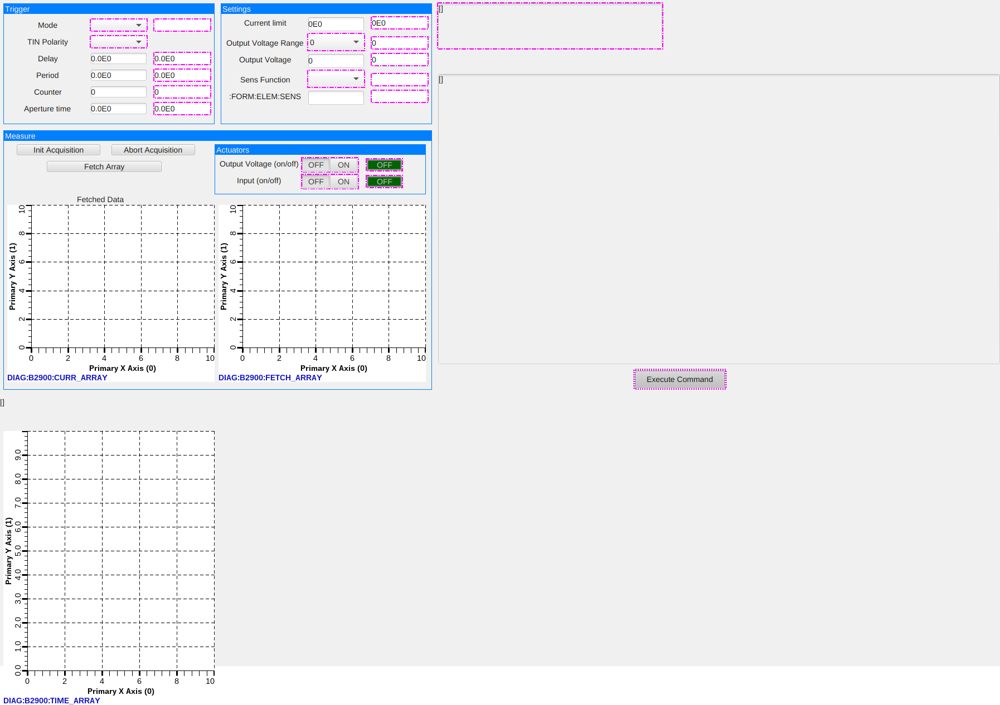

# B2900 EPICS Support (WIP)

This a basic EPICS support for the B2900 Electrometer from Keysight. It is using the StreamDevice generic device support to send and receive serial commands through an Ethernet interface.

It was based on the development of a similar EPICS support using StreamDevice [DG645 Delay Generator Support](https://github.com/IFMIF/srs_dg645).

### Disclaimers: 

This work was quickly developed to meet the needs at a point in time. It is not finalized so be careful!

Also, it was developed in the very early stages of the LIPAc CS EPICS upgrade to V7. As a consequence, the developments can seem uncoherent regarding the way EPICS 7 was used later on. 

Features:
- [x] Communication with the device
- [x] Data acquisition (waveform)
- [ ] Data process (parser) on the array outputs (attempted but wasn't fully complete)

## GUI

The GUI provided is based on Phoebus. It was used as is by our operator, who would then manually dispose of outputs (don't mind the disconnections in the screenshot, the device was not available at this time).

## Requirements

The support has been operated with the following EPICS ecosystem:
- base 7.0.7
- asyn 4.44.2
- StreamDevice 2.8.16

## Building

First, edit the RELEASE file (or RELEASE.local) to match with the different EPICS modules of your installation.

Then, build the support: `make` (usually).

## Usage

A soft IOC is available. Edit the `iocBoot\iocB2900\st.cmd` with the IP or hostname of your device.